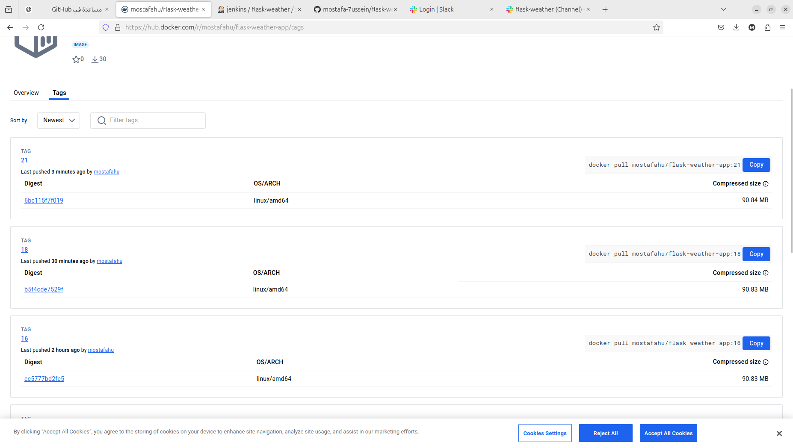
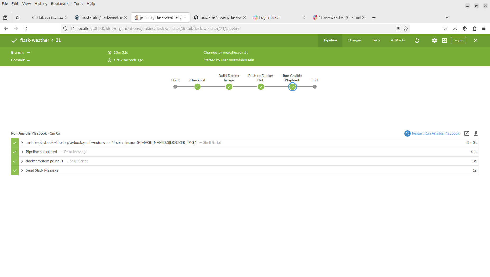
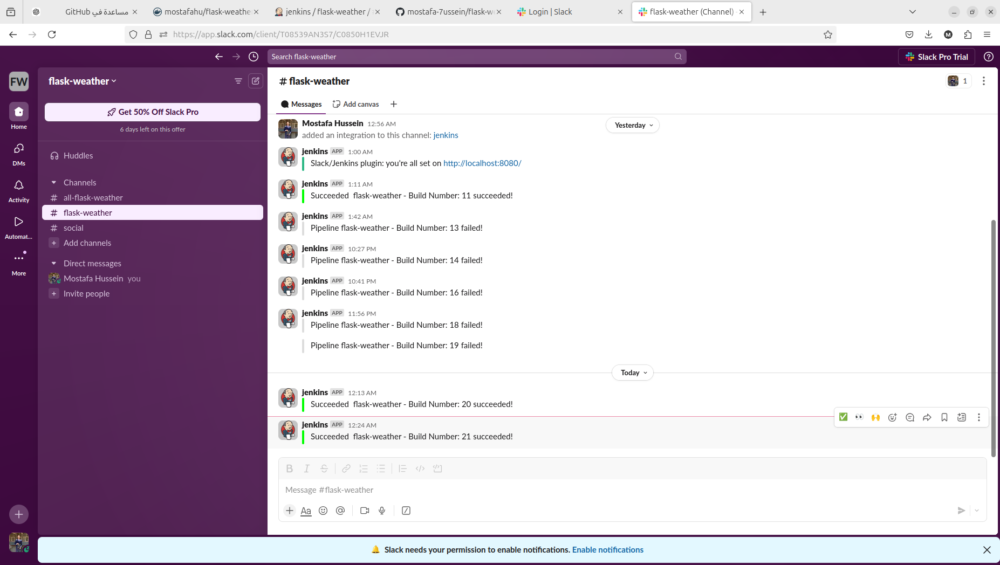

# Flask Weather App 🌦️

A simple weather application built with Flask, using OpenWeather API to fetch weather data. This app allows users to add cities, store weather data in an SQLite database, and view a temperature plot for the cities.

## Features 🚀

- **Add a City**: Users can add cities and fetch the weather information.
- **Weather Data**: View the weather data (temperature, humidity, description) for added cities.
- **Temperature Plot**: View a plot of temperatures for the cities added.

## Prerequisites ⚙️

Before starting, ensure you have the following installed:

- **Python 3.x** 🐍
- **Docker** 🐋 (optional, for containerized deployment)
- **Git** for version control

## Setup Instructions ⚡

### 1. Clone the Repository

Clone the repository to your local machine:

bash
git clone https://github.com/mostafa-7ussein/flask-weather.git
cd flask-weather

## 2. Install Dependencies

Create a Python virtual environment and install the dependencies listed in requirements.txt:

pip install -r requirements.txt

## 3. Configure OpenWeather API Key 🌐

In app.py, replace the placeholder 'your_openweathermap_api_key' with your actual OpenWeather API key. You can obtain your API key from OpenWeather.

API_KEY = 'your_openweathermap_api_key'

## 4. Running the Application 🏃‍♂️

Run the Flask app locally with:

python app.py

The application will be accessible at http://localhost:5000.

Docker Deployment (Optional) 🐳

If you prefer running the app in a Docker container:

### 1. Build the Docker Image

To build the Docker image, run:

docker build -t flask-weather-app .

### 2. Run the Docker Container

Start the container:
docker run -p 5000:5000 flask-weather-app

Your app will be available at http://localhost:5000.

## Ansible Deployment ⚙️

This project includes an Ansible playbook to automate the setup and deployment on remote hosts.
### 1. Install Ansible

Make sure Ansible is installed:

sudo apt install ansible

### 2. Run the Playbook

To deploy the app on remote hosts, run the following command:

ansible-playbook -i hosts playbook.yaml

Make sure your hosts file is configured with the appropriate IP addresses and SSH keys.

Jenkins CI/CD Pipeline 🔧

This repository includes a Jenkins pipeline (Jenkinsfile) for automating the build, Docker image push, and Ansible deployment:

    Checkout: Pulls the latest code from GitHub.
    Build Docker Image: Builds the Docker image.
    Push to Docker Hub: Pushes the built image to Docker Hub.
    Run Ansible Playbook: Deploys the app on remote hosts using Ansible.

Environment Variables 🛠️

    GIT_REPO: URL of the Git repository.
    GIT_CREDENTIALS_ID: Jenkins credentials for accessing the GitHub repo.
    DOCKERHUB_CREDENTIALS_ID: Jenkins credentials for Docker Hub login.
    IMAGE_NAME: Docker image name (e.g., mostafahu/flask-weather-app).
    DOCKER_TAG: Docker image tag, usually the build number.

Application Structure 📁

    app.py: The main Flask application code.
    Dockerfile: Dockerfile for building the app image.
    requirements.txt: Python dependencies for the app (Flask, requests, matplotlib).
    templates/: HTML templates for rendering the pages.
    Jenkinsfile: Jenkins pipeline configuration for automated deployment.
    playbook.yaml: Ansible playbook for deploying the app on remote servers.

## Screenshots 📸

### Docker Hub 🌐

### Jenkins Pipeline 🔄

### Slack Notifications 📲

Contributing 🤝

Contributions are welcome! To contribute:

    Fork the repository.
    Create a new branch (git checkout -b feature-name).
    Make your changes and commit (git commit -am 'Add new feature').
    Push to your branch (git push origin feature-name).
    Open a pull request.

    License 📄

This project is licensed under the MIT License - see the LICENSE file for details.

### Key Notes:
- Replace the `assets/images/...` links with the actual paths where your images are stored.
- The images you want to show (such as screenshots of Docker Hub, Jenkins pipeline, and Slack notifications) should be placed inside the `assets/images` folder, and the file names should match the ones in the `README.md`.

This `README.md` now provides a complete guide with image links and relevant information for your project.
